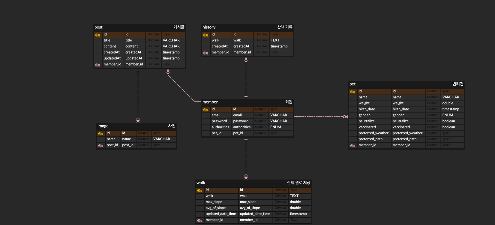

# TEAM22_BE

반려견 보호자를 위한 산책 적합 날씨와 경로 경사도 분석 서비스입니다.

> **카카오테크캠퍼스 3기 TEAM22 백엔드**
>
> 개발기간: 2025.08 ~

## 💻 개발 배경

최근 미세먼지와 지구온난화로 인해 대기질이 악화되고, 기후 변화도 점점 심해지고 있습니다. 특히 반려견은 사람보다 미세먼지에 더 취약하고, 기온 변화에도 민감하게 반응하기 때문에
산책 시 각별한 주의가 필요합니다.

이 프로젝트는 보호자가 반려견과 함께 안전하고 즐겁게 산책할 수 있도록, **현재 날씨가 산책에 적합한지**, 그리고 **반려견의 건강 상태를 고려했을 때 계획한 산책 경로가
무리없는지** 를 쉽게 확인할 수 있게 돕는 것을 목표로 하고 있습니다.

## 💡 협업 룰

[팀 그라운드 룰](https://teamsparta.notion.site/2432dc3ef5148148a70fca901e2efc7d?source=copy_link)
[코딩 컨벤션](https://teamsparta.notion.site/2432dc3ef5148171a993c4a5de18bb60?source=copy_link)
[커밋 컨벤션](https://teamsparta.notion.site/2432dc3ef51481ee9faef08d6a0f062b?source=copy_link)

## 🔗 배포 URL

백엔드 프로젝트의 현재 배포된 URL은 다음과 같습니다.

> [https://spring-gift.store](https://spring-gfit.store)

## 📝 API 명세서

Swagger를 통해 API 명세서를 자동화하고자 했습니다.

> **End Point**
>
> `/swagger-ui/index.html`

> **Local**
>
> [http://localhost:8080/swagger-ui/index.html](http://localhost:8080/swagger-ui/index.html)

> **Deployment**
>
> [https://spring-gift.store/swagger-ui/index.html](https://spring-gift.store/swagger-ui/index.html)

## 📄 ERD

## 📚 기술 스택

 

  
  
  
  
   
  
  
  
   
  
  
  
  
  
  

## ⚙️ 환경변수

`spring.cloud.aws.credentials`를 제외한 환경변수들은 AWS Parameter Store에서 관리되고 있습니다.

- `$ACCESS_KEY`: IAM 계정의 access key 정보
- `$SECRET_KEY`: IAM 계정의 secret key 정보

#### 데이터베이스 환경

- 로컬 개발 환경: H2 Database 사용 (`spring.profiles.active=dev`)
- 배포/운영 환경: MySQL Database 사용 (`spring.profiles.active=prod`)

## ⚒️ 주요 기능

#### 회원

- **회원가입**: 이메일, 사용자 이름, 비밀번호를 입력하여 회원가입을 할 수 있습니다.
- **로그인**: 이메일, 비밀번호를 입력하여 로그인을 할 수 있습니다.

#### 반려견

- **반려견 정보 등록**: 사용자는 본인의 반려견 정보를 등록할 수 있습니다.

#### 산책 경로

- **주 산책 경로 등록**: 사용자는 주 산책 경로를 등록할 수 있습니다.
- **주 산책 경로 조회**: 사용자는 주 산책 경로를 조회할 수 있습니다.
- **주 산책 경로 경사도 제공**: 시스템은 사용자가 등록한 주 산책 경로의 평균 경사도, 최고 경사도를 계산하여 제공합니다. 이 때 경사도가 반려견에 적합한지 계산하여
  반환합니다.

#### 날씨 정보

- **날씨 정보 조회**: 사용자는 날씨 정보를 조회할 수 있습니다. 이 때, 등록되어 있는 사용자의 반려견에 맞추어 산책 지수가 표기됩니다.

더 자세한 내용은 기능 명세서 노션 페이지에서 확인 가능합니다.

[기능 명세서 페이지 바로가기](https://teamsparta.notion.site/24a2dc3ef51480f49307e08214769536?source=copy_link)

## 📈 앞으로의 로드맵

1. 사용자와 반려견의 일대다 매핑 도입
2. 지난 산책 기록 조회 기능 도입
3. 주 산책 경로 재구성/재등록 기능 도입
4. 반려견의 비만 여부 확인 및 이에 따른 가중치 테이블 추가
